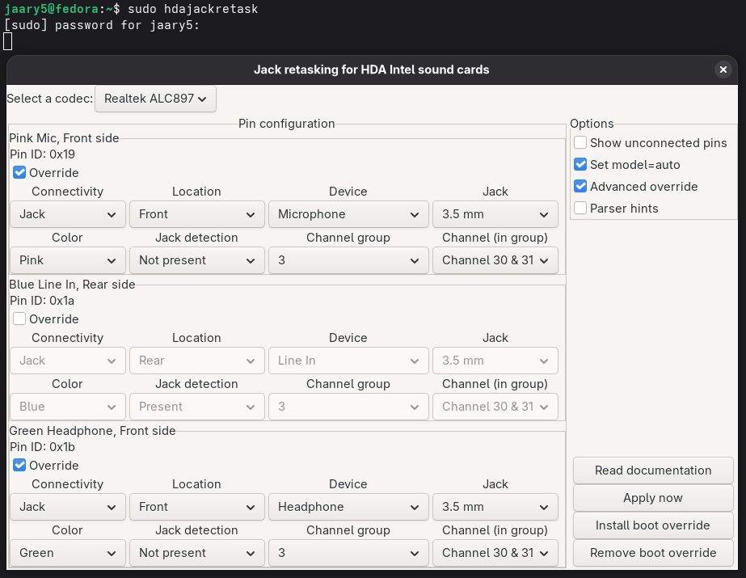

# Sound Debug

## Hardware

- **Motherboard:** MSI B450-A PRO MAX II
- **Audio Codec:** Realtek ALC897

## Problem

On a fresh Linux installation:

- Rear Line Out does not work correctly.
- Front headphone jack does not work correctly.

This issue persists across all Linux distributions.


## Solution

### 1. Install HDA Jack Retask

```bash
sudo pacman -S alsa-tools
```

### 2. Launch HDA Jack Retask

```bash
sudo hdajackretask
```

### 3. Select the codec

```
Realtek ALC897
```

### 4. Enable these options

- ☑ Set model = auto
- ☑ Advanced override

### 5. Configure the following pin overrides

#### Pink Mic, Front side (Pin ID: 0x19)

- ☑ Override
- Connectivity: Jack
- Location: Front
- Device: Microphone
- Jack: 3.5 mm
- Color: Pink
- Jack detection: Not present
- Channel group: 3
- Channel (in group): 30 & 31

#### Green Headphone, Front side (Pin ID: 0x1b)

- ☑ Override
- Connectivity: Jack
- Location: Front
- Device: Headphone
- Jack: 3.5 mm
- Color: Green
- Jack detection: Not present
- Channel group: 3
- Channel (in group): 30 & 31

### 6. Verify against the screenshot



### 7. Apply the changes

Click:

- **Apply now**
- **Install boot override**

### 8. Reboot

Restart the computer for the changes to take effect.